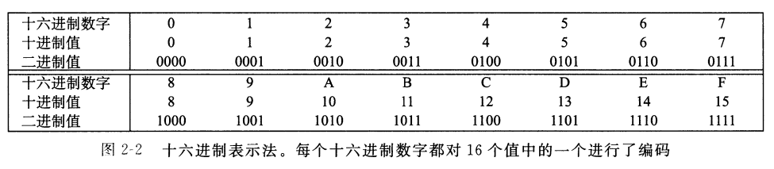
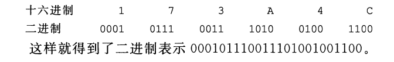
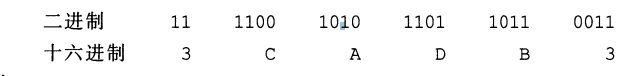
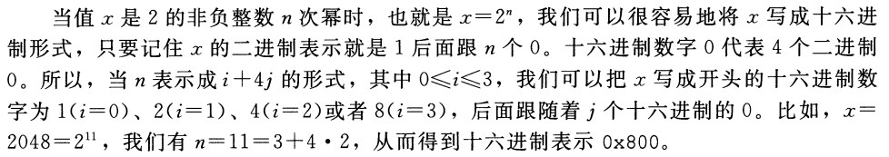
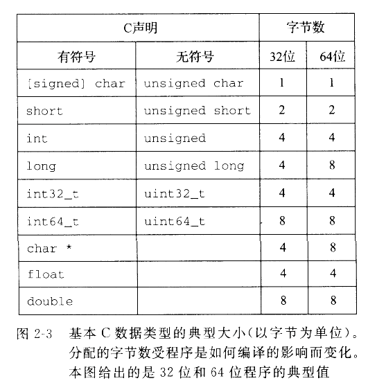
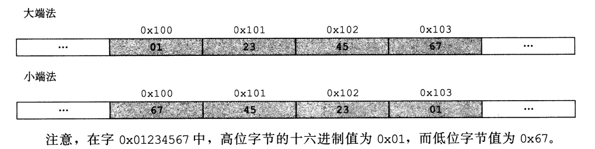
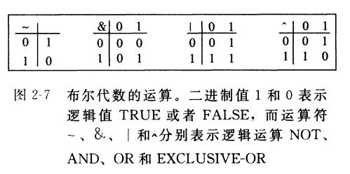
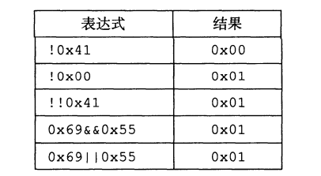

### 一 计算机系统漫游
##### 1.1 信息就是位+上下文
```
区分不同数据对象的唯一方法是我们读到这些数据对象时的上下文。比如,在不同的上下文中,一个同样的字节序列可能表示一个整数、浮点数、
字符串或者机器指令。
```

##### 1.2 程序被其他程序翻译成不同的格式

```
预处理器、编译器、汇编器和链接器 = 编译系统(compilation system)
```

##### 1.4 处理器读并解释储存在内存中的指令

```
 sheⅡ是一个命令行解释。
```

###### 1.4.1 系统的硬件组成

```
1 总线
  贯穿整个系统的是一组电子管道,称作总线,它携带信息字节并负责在各个部件间传递。通常总线被设计成传送定长的字节块,也就是字(word)。
  多数机器要么4字节（32位）/8字节（64位）。
2 I/O设备
  键盘/鼠标/显示器/磁盘
  每个I/O设备都通过一个控制器或适配器与I/O总线相连。控制器和适配器之间的区别主要在于它们的封装方式。
```

 

```
3. 主存
主存是一个临时存储设备,在处理器执行程序时,用来存放程序和程序处理的数据。
主存是由一组动态随机存取存储器(DRAM)芯片组成。
从逻辑上来说,存储器是一个线性的字节数组,每个字节都有其唯一的地址(数组索引),这些地址是从零开始
的。一般来说,组成程序的每条机器指令都由不同数量的字节构成
4. 处理器
中央处理单元(CPU),简称处理器,是解释(或执行)存储在主存中指令的引擎.
处理器的核心是一个大小为一个字的存储设备(或寄存器),称为程序计数器(PC)。
从系统通电开始,直到系统断电,处理器一直在不断地执行程序计数器指向的指令,再更新程序计数器,使其指向下一条指令。
处理器从程序计数器指向的内存处读取指令,解释指令中的位,执行该指令指示的简单操作,然后更新PC,使其指向下一条指令,
而这条指令并不一定和在内存中刚刚执行的指令相邻。
	●加载:从主存复制一个字节或者一个字到寄存器,以覆盖寄存器原来的内容。
	●存储:从寄存器复制一个字节或者一个字到主存的某个位置,以覆盖这个位置上原来的内容。
	●操作:把两个寄存器的内容复制到ALU, ALU对这两个字做算术运算,并将结果存放到一个寄存器中,以覆盖该寄存器中原来的内容。
	●跳转:从指令本身中抽取一个字,并将这个字复制到程序计数器(PC)中,以覆盖PC中原来的值。

```

###### 1.4.2  运行hello程序

##### 1.5  高速缓存至关重要

```
从磁盘驱动器上读取一个字的时间开销要比从主存中读取的开销大1000万倍.
一个典型的寄存器文件只存储几百字节的信息,而主存里可存放几十亿字节。
处理器从寄存器文件中读数据比从主存中读取几乎要快100倍。
出现高速缓存存储器[原因]：处理器与主存之间的差异.
说明：
	位于处理器芯片上的Ll高速缓存的容量可以达到数万字节.
	访问速度几乎和访间寄存器文件一样快。
	一个容量为数十万到数百万字节的更大的L2高速缓存通过一条特殊的总线连接到处理器。
	进程访问L2高速缓存的时间要比访问Ll高速缓存的时间长5倍。
	但是这仍然比访间主存的时间快5-10倍。
实现：
	Ll和L2高速缓存是用一种叫做静态随机访问存储器(sRAM)的硬件技术实现的。

```


 

##### 1.6 存储设备形成层次结构

 

##### 1.7 操作系统管理硬件

```
说明：
	操作系统看成是应用程序和硬件之间插入的一层软件。
操作系统有两个基本功能: 
	(1)防止硬件被失控的应用程序滥用;
	(2)向应用程序提供简单一致的机制来控制复杂而又通常大不相同的低级硬件设备。
实现：
	操作系统通过几个基本的抽象概念(进程、虚拟内存和文件)来实现这两个功能。如图1-11所示。
```

 

###### 1.7.1 进程

```
说明：
进程是操作系统对一个正在运行的程序的一种抽象。
在一个系统上可以同时运行多个进程,而每个进程都好像在独占地使用硬件。
而并发运行,则是说一个进程的指令和另一个进程的指令是交错执行的。
传统系统在一个时刻只能执行一个程序,而先进的多核处理器同时能够执行多个程序。
一个CPU看上去都像是在并发地执行多个进程,这是通过处理器在进程间切换来实现的。操作系统实现这种交错执行的机制称为上下文切换。
```

###### 1.7.2 线程

```
说明：
一个进程实际上可以由多个称为线程的执行单元组成,每个线程都运行在进程的上下文中,并共享同样的代码和全局数据。
多线程之间比多进程之间更容易共享数据。也因为线程一般来说都比进程更高效。
```

###### 1.7.3 虚拟内存

```
虚拟内存是一个抽象概念,它为每个进程提供了一个假象。
即每个进程都在独占地使用主存。每个进程看到的内存都是一致的,称为虚拟地址空间。
每个进程看到的虚拟地址空间由大量准确定义的区构成：
    ●程序代码和数据。对所有的进程来说,代码是从同一固定地址开始,紧接着的是和
     C全局变量相对应的数据位置。代码和数据区是直接接照可执行目标文件的内容初
     始化的
    ●堆。代码和数据区后紧随着的是运行时堆。代码和数据区在进程一开始运行时就被
     指定了大小,与此不同,当调用像malloc和free这样的C标准库函数时,堆可以在运
     行时动态地扩展和收缩。
    ●共享库。大约在地址空间的中间部分是一块用来存放像C标准库和数学库这样的共
     享库的代码和数据的区域。共享库的概念非常强大,也相当难懂。
    ●栈。位于用户虚拟地址空间顶部的是用户栈,编译器用它来实现函数调用。和堆一
     样,用户栈在程序执行期间可以动态地扩展和收缩。特别地,每次我们调用一个函
     数时,栈就会增长;从一个函数返回时,栈就会收缩。
    ●内核虚拟内存。地址空间顶部的区域是为内核保留的。不允许应用程序读写这个区
     域的内容或者直接调用内核代码定义的函数。相反,它们必须调用内核来执行这些
     操作。

```

###### 1.7.4 文件

```
文件就是字节序列,仅此而已。每个Ⅰ/o设备,包括磁盘、键盘、显示器,甚至网络,都可以看成是文件。
系统中的所有输人输出都是通过使用一小组称为Unix I/o的系统函数调用读写文件来实现的。
```

##### 1.8 系统之间利用网络通信

​	从一个单独的系统来看,网络可视为一个 Ⅰ/o设备。

​	在远端运行hello程序 包括如图1-15所示的五个基本步骤。

​	

##### 1.9 重要主题

###### 1.9.1 Amdahl定律

  Gene Amdahl,计算领域的早期先锋之一,对提升系统某一部分性能所带来的效果做 出了简单却有见地的观察。这个Amdahl定律(Amdahl,s law）该定律的主要思想是,当我们对系统的某个部分加速时,其对系统整体性能的影响取决于该部分的 重要性 和 加速程度。

​	若系统执行某应用程序需要时间为:			  T(old)
​	假设系统某部分 所需执行时间 与 该时间的比例为: α
​	而该部分性能提升比例为: 					k
​	该部分初始所需时间为: 					  αT(old)
​	现在所需时间为:							(αT(old)/k
​	此,总的执行时间应为:
$$
Tnew = (1一α)Told + (αTold)/k = Told[(1 -a) + a/k]
$$
​	由此,可以计算加速比 S = T(old)/T(now)为
$$
S = \dfrac{1}{(1 - a) + a/k}
$$
​	举个例子,考虑这样一种情况,系统的某个部分初始耗时比例为60%(α=0.6),其加速比 例因子为3(k=3)。则我们可以获得的加速比为1/[0.4+0.6/3]=1.67。

###### 1.9.2 并发和并行

数字计算机的整个历史中,有两个需求是驱动进步的持续动力:一个是我们想要计算 机做得更多,另一个是我们想要计算机运行得更快。

​	1.线程级并发

​	传统意义上，通过使一台计算机在它正在执行的进程间快速切换来实现的。

​	多核处理器 是将多个CPU(称为“核″)集成 到一个集成电路芯片上。结构图

​    	

​	超线程，也称为同时多线程(simultaneous multi-threading),是一项允许一个CPU 执行多个控制流的技术。

### 二 信息的表示和处理

​	对于有10个手指的人类来说,使用十进制表示法是很自然的事情，但是当构造存储和处理信息的机器时,二进制值工作得更好。
​	二值信号能够很容易地被表示、存储和传输。
​	无符号(unsigned)编码基于传统的二进制表示法,表示大于或者等于零的数字。
​	补码(two’s-complement)编码是表示有符号整数的最常见的方式,
​	有符号整数就是可以为正或者为负的数字。
​	浮点数(floating-point)编码是表示实数的科学记数发的以2为基数的版本。
​	计算机可能没有产生期望的结果,但是至少它是一致的!
​	表示的精度有限,浮点运算是不可结合的。在大多数机器上, 
​	C表达式(3.14十1e20)一1e20求得的值会是O.0,而3.14十(le20-1e20)求得的值会是3.140
​	整数的表示虽然只能编码一个相对较小的数值范围,但是这种表示是精确的;而浮点数虽然可以编码一个较大的数值范围,但是这种表示只是近似的。

#### 2.1 信息存储

​	大多数计算机使用8位的块,或者字节(byte),作为最小的可寻址的内存单位。而不是访问内存中单独的位。
​	机器级程序将内存视为一个非常大的字节数组,称为虚拟内存(virtual memory)。
​	内存的每个字节都由一个唯一的数字来标识,称为它的地址(address),所有可能地址的集合就称为虚拟地址空间(virtual address space),
​	机器级程序的概念性映像。
​	C语言中一个指针的值(无论它指向一个整数、一个结构或是某个其他程序对象)都是某个存储块的第一个字节的虚拟地址。
​	每个程序对象可以简单地视为一个字节块,而程序本身就是一个字节序列。

##### 2.1.1 十六进制表示法

一个字节由8位组成。
在二进制表示法中,它的值域是00000000-11111111(二进制)
十进制整数,它的值域就是0~255
二进制表示洼太冗长,而十进制表示法与位模式的互相转化很麻烦。替代的方法是,以16为基数。

 
以Ox或OX开头的数字常量被认为是十六进制的值。

###### 一 十六进制 -> 二进制

 

###### 二 二进制 -> 十六进制

 

###### 三 幂运算

	

###### 四 十进制 -> 十六进制

反复地用16除引得到一个商q和一个余数r,r作为最低位数字。

###### 五 十六进制 -> 十进制

16的幂乘以每个十六进制数字。后各自相加。

##### 2.1.2 字数据的大小

大多数64位机器也可以运行为32位机器编译的程序,这是一种向后兼容。

32位/64位程序能否运行，区别在于该程序是如何编译的, 而不是其运行的机器类型。

 
避免小和不同编译器设置带来的奇怪行为, ISO C99 int32_t和int64_t(固定大小)。

##### 2.1.3 寻址和字节顺序

这个对象的地址是什么?
以及在内存中如何排列这些字节?

地址表达式&x的值为Ox100(假设数据类型int为32位表示)x的4个字节将被存储在内存的Ox100、 Ox101、 Ox1O2和Ox1O3位置。
有效字节在最前面的方式,称为大端法(big endian)
字节在最前面的方式,称为小端法(little endian)
 

说明：
字节顺序会成为问题。
在不同类型的机器之间通过网络传送二进制数据时,一个常见的问题是当小端法机器产生的数据被发送到大端法机器或者反过来时,
接收程序会发现,字里的字节成了反序的。
第二种情况是,当阅读表示整数数据的字节序列时字节顺序也很重要。
第三种情况是，编写规避正常的类型系统的程序时。制类型转换。

一个值得注意的特性是Linux 32、 Windows和Sun的机器使用4字节地址,而Linux64使用8字节地址。

##### 2.1.4 表示字符串

C语言中字符串被编码为一个以null(其值为0)字符结尾的字符数组。每个字符都由 某个标准编码来袁示,最常见的是ASCⅡ字符码。
Java编程语言使用Unicode来表示字符串。对于C语言也有支持Unicode的程序库。

##### 2.1.5 表示代码

不同的机器类型使用不同的且不兼容的指令和编码方式。因此二进制代码是不兼容的。
从机器的角度来看,程序仅仅只是字节序列。

##### 2.1.6 布尔代数

TRUE(真)和 FALSE(假)编码为二进制值1和0


布尔运算^对应于逻辑运算异或。
布尔运算扩展到位向量的运算。

##### 2.1.7 C语言中的位级运算

C语言的一个很有用的特性就是它支持按位布尔运算。

##### 2.1.8 C语言中的逻辑运算

逻辑运算很容易和位级运算相混淆,但是它们的功能是完全不同的。
逻辑运算认为所有非零的参数都表示TRUE,而参数0表示FALSE它们返回1或者O。


接位运算只有在特殊情况下,也就是参数被限制为0或者1时,才和与其对应的逻辑运算有相同的行为。
第一个参数求值就能确定表达式的结果,那么逻辑运算符就不会对第二个参数求值。

##### 2.1.9 C语言中的移位运算
